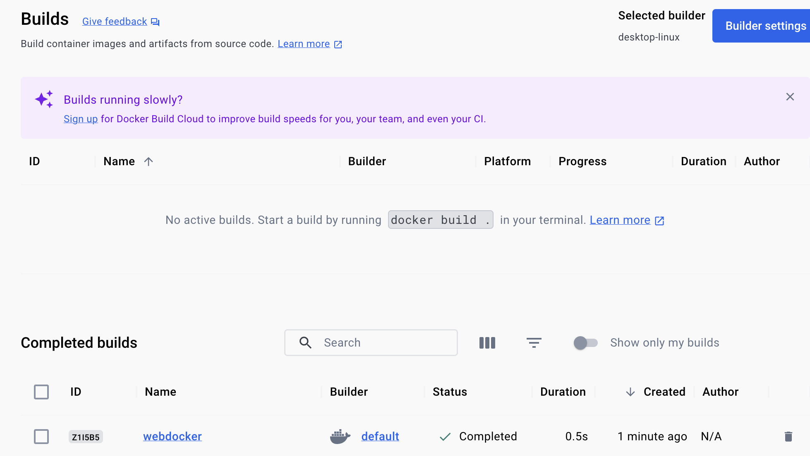

# Week 4: Create and Containerize Actix Microservice 

# Dependencies
* To do this, I create a docker image. Thus, it is required that you have installed docker, specifically docker desktop. Create an account and log in.
* Additionally, this microservice uses rust. Make sure that rust in installed. Use `rustc -v` to confirm it is installed.

# Build Microservice
* Create a new repository
* Run `cargo new {projectname}` to instantiate a rust project
* Create a makefile (with commonly used commands) and a cargo.toml file (which will hold our dependencies
    * dependencies include: actix-web = "4" rand = "0.8"
* Update code in main.rs/lib.rs to perform the actions wanted for the web microservice.
    * I chose to make the app ask you a random question, depending on a precreated array.
    * In a future iteration of this app, the user will have the opportunity to answer the question.
* Run cargo run to confirm app works as you expect
 
# Containerizing the Microservice
* Confirm docker desktop is up and running
* Build docker image by running `docker build -t {nameofimage} .`
* Run the docker container by running `docker run -p 8080:8080 {nameofimage}`

# Confirm the application works
* go to the local host and confirm your app works

# Screenshots
## Testing app

## Docker Build:

## Docker running locally / Docker Destop

## App in Web Browser

